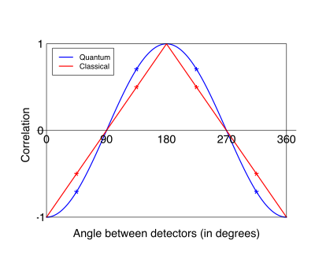

* The standard model often called the Copenhagen interpretation gives us the mathematics describing qubits. It is named after where Niels Bohr was living and working (Copenhagen).
* Einstein and Schrödinger didn’t like this model, with its interpretation of states jumping with given probabilities to basis states. They objected to both the use of probability and to the concept of action at a
distance. 
* They thought that there should be a better model using “hidden variables” and “local realism.” They weren’t objecting to using the Copenhagen model for doing calculations, but they thought that there should be a deeper theory that would explain why the calculations were producing correct answers
* In short, they wanted a theory that eliminated the randomness and explained the mystery.
* However, we all now know that Einstein and Schrödinger’s view was wrong and that the Copenhagen model is regarded as the standard description.
* *local realism* means that a particle can only be influenced by something changing in its vicinity. Practically all of us are local realists, but quantum mechanics shows us that we are wrong.

